# Seedling HQ Development Guide

A comprehensive guide for developing new features in the Seedling HQ monorepo, covering the complete tech stack from frontend to backend.

## 📋 Table of Contents

1. [Tech Stack Overview](#tech-stack-overview)
2. [Project Architecture](#project-architecture)
3. [Development Environment Setup](#development-environment-setup)
4. [Frontend Development (React + Vite)](#frontend-development)
5. [Shared Types Development](#shared-types-development)
6. [Backend Development (Fastify + Lambda)](#backend-development)
7. [Full-Stack Feature Development Workflow](#full-stack-feature-development-workflow)
8. [Testing Strategies](#testing-strategies)
9. [Deployment Guide](#deployment-guide)
10. [Best Practices & Conventions](#best-practices--conventions)

---

## Tech Stack Overview

### Frontend Stack
- **React 19** - Latest React with concurrent features
- **TypeScript** - Type safety and enhanced developer experience
- **Vite 7** - Ultra-fast build tool and development server
- **ESLint 9** - Modern flat config linting

### Backend Stack
- **Fastify** - High-performance Node.js web framework
- **AWS Lambda** - Serverless compute platform
- **TypeScript** - End-to-end type safety
- **Serverless Framework** - Infrastructure as Code

### Shared Infrastructure
- **Turborepo** - Monorepo build orchestration with intelligent caching
- **Yarn 4 (PnP)** - Fast package management with Plug'n'Play
- **TypeScript** - Consistent typing across all packages

---

## Project Architecture

### 🏗️ System Architecture Diagram

```mermaid
graph TB
    %% User Layer
    USER[👤 User]
    
    %% Frontend Layer
    subgraph "Frontend (React + Vite)"
        WEB[🌐 Web App<br/>Port: 5173]
        COMPONENTS[🧩 Components]
        HOOKS[🎣 Custom Hooks]
        SERVICES[🔄 API Services]
        PAGES[📄 Pages]
    end
    
    %% API Gateway
    subgraph "API Gateway"
        GATEWAY[🚪 AWS API Gateway<br/>HTTPS Endpoint]
    end
    
    %% Backend Layer
    subgraph "Backend (Fastify + Lambda)"
        LAMBDA[⚡ AWS Lambda<br/>Node.js Runtime]
        FASTIFY[🚀 Fastify App]
        ROUTES[🛣️ Route Handlers]
        MIDDLEWARE[🛡️ Middleware<br/>Auth, CORS, Rate Limiting]
        BIZLOGIC[💼 Business Logic<br/>Services]
    end
    
    %% Data Layer
    subgraph "Data Layer (Future)"
        DB[(🗄️ Database<br/>PostgreSQL/DynamoDB)]
        CACHE[(⚡ Cache<br/>Redis)]
        STORAGE[📁 File Storage<br/>S3]
    end
    
    %% Shared Types
    subgraph "Shared Package"
        TYPES[📝 TypeScript Types<br/>Cross-package Definitions]
    end
    
    %% Development Tools
    subgraph "Development Infrastructure"
        TURBO[🏃 Turborepo<br/>Build Orchestration]
        YARN[📦 Yarn Workspaces<br/>Package Management]
        ESLINT[✅ ESLint<br/>Code Quality]
        TS[🔷 TypeScript<br/>Type Safety]
    end
    
    %% Deployment
    subgraph "Deployment"
        VERCEL[🚀 Vercel<br/>Frontend Hosting]
        AWS[☁️ AWS<br/>Serverless Backend]
        SERVERLESS[📋 Serverless Framework<br/>Infrastructure as Code]
    end
    
    %% Connections
    USER --> WEB
    WEB --> COMPONENTS
    WEB --> HOOKS
    WEB --> SERVICES
    WEB --> PAGES
    
    SERVICES --> GATEWAY
    GATEWAY --> LAMBDA
    LAMBDA --> FASTIFY
    FASTIFY --> ROUTES
    FASTIFY --> MIDDLEWARE
    ROUTES --> BIZLOGIC
    
    BIZLOGIC --> DB
    BIZLOGIC --> CACHE
    BIZLOGIC --> STORAGE
    
    %% Type sharing
    TYPES -.-> WEB
    TYPES -.-> LAMBDA
    
    %% Development flow
    TURBO -.-> WEB
    TURBO -.-> LAMBDA
    YARN -.-> TURBO
    ESLINT -.-> WEB
    ESLINT -.-> LAMBDA
    TS -.-> WEB
    TS -.-> LAMBDA
    TS -.-> TYPES
    
    %% Deployment flow
    WEB --> VERCEL
    LAMBDA --> AWS
    SERVERLESS -.-> AWS
    
    %% Styling
    classDef frontend fill:#61dafb,stroke:#333,stroke-width:2px,color:#000
    classDef backend fill:#ff6b6b,stroke:#333,stroke-width:2px,color:#fff
    classDef data fill:#4ecdc4,stroke:#333,stroke-width:2px,color:#000
    classDef tools fill:#ffe66d,stroke:#333,stroke-width:2px,color:#000
    classDef deploy fill:#a8e6cf,stroke:#333,stroke-width:2px,color:#000
    classDef shared fill:#dda0dd,stroke:#333,stroke-width:2px,color:#000
    
    class WEB,COMPONENTS,HOOKS,SERVICES,PAGES frontend
    class LAMBDA,FASTIFY,ROUTES,MIDDLEWARE,BIZLOGIC,GATEWAY backend
    class DB,CACHE,STORAGE data
    class TURBO,YARN,ESLINT,TS tools
    class VERCEL,AWS,SERVERLESS deploy
    class TYPES shared
```



### 📂 File Structure

```
seedling-hq/
├── apps/
│   └── web/                 # React frontend application
│       ├── src/
│       │   ├── components/  # Reusable React components
│       │   ├── pages/       # Page components (routing)
│       │   ├── hooks/       # Custom React hooks
│       │   ├── services/    # API client services
│       │   ├── types/       # Frontend-specific types
│       │   ├── utils/       # Frontend utilities
│       │   └── main.tsx     # Application entry point
│       ├── public/          # Static assets
│       ├── package.json     # Frontend dependencies
│       └── vite.config.ts   # Vite configuration
├── packages/
│   ├── api/                 # Fastify serverless API
│   │   ├── src/
│   │   │   ├── routes/      # API route handlers
│   │   │   ├── services/    # Business logic services
│   │   │   ├── middleware/  # Custom middleware
│   │   │   ├── utils/       # Backend utilities
│   │   │   ├── app.ts       # Fastify application
│   │   │   ├── lambda.ts    # AWS Lambda handler
│   │   │   └── dev-server.ts # Local development server
│   │   ├── serverless.yml   # AWS deployment config
│   │   └── package.json     # Backend dependencies
│   └── types/               # Shared TypeScript types
│       └── src/
│           ├── user.ts      # User-related types
│           ├── api.ts       # API request/response types
│           └── index.ts     # Type exports
├── package.json             # Root workspace configuration
├── turbo.json              # Turborepo configuration
└── yarn.lock               # Dependency lock file
```

### 🔄 Data Flow Architecture

```mermaid
sequenceDiagram
    participant U as 👤 User
    participant W as 🌐 Web App
    participant S as 🔄 API Service
    participant G as 🚪 API Gateway
    participant L as ⚡ Lambda
    participant F as 🚀 Fastify
    participant M as 🛡️ Middleware
    participant R as 🛣️ Routes
    participant B as 💼 Business Logic
    participant D as 🗄️ Database
    
    U->>W: Interact with UI
    W->>S: Call API method
    S->>G: HTTPS Request
    G->>L: Invoke Lambda
    L->>F: Handle Request
    F->>M: Apply Middleware
    M->>R: Route to Handler
    R->>B: Execute Business Logic
    B->>D: Query Database
    D-->>B: Return Data
    B-->>R: Process Response
    R-->>F: Send Response
    F-->>L: Return Result
    L-->>G: Lambda Response
    G-->>S: HTTP Response
    S-->>W: Update State
    W-->>U: Render UI
```



### 🏭 Development vs Production Architecture

#### Development Environment

```mermaid
graph LR
    subgraph "Local Development"
        DEV_WEB[🌐 Vite Dev Server<br/>localhost:5173]
        DEV_API[🚀 Fastify Server<br/>localhost:3001]
        DEV_WEB --> DEV_API
    end
    
    DEV_TYPES[📝 Shared Types<br/>workspace:*]
    DEV_WEB -.-> DEV_TYPES
    DEV_API -.-> DEV_TYPES
    
    classDef dev fill:#ffd93d,stroke:#333,stroke-width:2px,color:#000
    class DEV_WEB,DEV_API,DEV_TYPES dev
```


#### Production Environment

```mermaid
graph LR
    subgraph "Production"
        PROD_CDN[🌐 Vercel CDN<br/>Static Assets]
        PROD_WEB[📱 React SPA<br/>your-app.vercel.app]
        PROD_API[⚡ AWS Lambda<br/>API Gateway Endpoint]
        
        PROD_WEB --> PROD_API
        PROD_CDN --> PROD_WEB
    end
    
    subgraph "AWS Infrastructure"
        CLOUDWATCH[📊 CloudWatch<br/>Logs & Metrics]
        IAM[🔐 IAM<br/>Permissions]
        PROD_API --> CLOUDWATCH
        IAM -.-> PROD_API
    end
    
    classDef prod fill:#4caf50,stroke:#333,stroke-width:2px,color:#fff
    class PROD_CDN,PROD_WEB,PROD_API,CLOUDWATCH,IAM prod
```


---

## Development Environment Setup

### Prerequisites
- **Node.js 22.12+** (Required for Vite 7.x compatibility)
- **Corepack** (Enable with `corepack enable`)
- **AWS CLI** (For serverless deployment)
- **Git** (Version control)

### Initial Setup
```bash
# Clone and setup
git clone <repository-url>
cd seedling-hq

# Enable Corepack (one-time setup)
corepack enable

# Install all dependencies
yarn install

# Build all packages
yarn build

# Start all development servers
yarn dev
```

### Development Servers
```bash
# Start all services (frontend + backend)
yarn dev

# Start individual services
yarn workspace @seedling-hq/web dev     # Frontend only (port 5173)
yarn workspace @seedling-hq/api dev     # Backend only (port 3001)
```

---

## Frontend Development

### 🎯 React Application Structure

#### Component Organization
```typescript
// apps/web/src/components/ui/Button.tsx
interface ButtonProps {
  variant?: 'primary' | 'secondary' | 'danger';
  size?: 'sm' | 'md' | 'lg';
  loading?: boolean;
  children: React.ReactNode;
  onClick?: () => void;
}

export function Button({ 
  variant = 'primary', 
  size = 'md', 
  loading = false,
  children, 
  onClick 
}: ButtonProps) {
  return (
    <button 
      className={`btn btn-${variant} btn-${size}`}
      disabled={loading}
      onClick={onClick}
    >
      {loading ? 'Loading...' : children}
    </button>
  );
}
```

#### Page Components with Routing
```typescript
// apps/web/src/pages/UsersPage.tsx
import { useState, useEffect } from 'react';
import { User } from '@seedling-hq/types';
import { userService } from '../services/userService';
import { Button } from '../components/ui/Button';

export function UsersPage() {
  const [users, setUsers] = useState<User[]>([]);
  const [loading, setLoading] = useState(true);
  const [error, setError] = useState<string | null>(null);

  useEffect(() => {
    async function fetchUsers() {
      try {
        setLoading(true);
        const fetchedUsers = await userService.getUsers();
        setUsers(fetchedUsers);
      } catch (err) {
        setError(err instanceof Error ? err.message : 'Failed to fetch users');
      } finally {
        setLoading(false);
      }
    }

    fetchUsers();
  }, []);

  if (loading) return <div>Loading users...</div>;
  if (error) return <div>Error: {error}</div>;

  return (
    <div>
      <h1>Users</h1>
      <Button onClick={() => window.location.href = '/users/new'}>
        Add User
      </Button>
      <ul>
        {users.map(user => (
          <li key={user.id}>
            {user.name} ({user.email})
          </li>
        ))}
      </ul>
    </div>
  );
}
```

#### Custom Hooks for State Management
```typescript
// apps/web/src/hooks/useUsers.ts
import { useState, useEffect } from 'react';
import { User } from '@seedling-hq/types';
import { userService } from '../services/userService';

export interface UseUsersResult {
  users: User[];
  loading: boolean;
  error: string | null;
  refetch: () => Promise<void>;
  createUser: (userData: Omit<User, 'id'>) => Promise<void>;
}

export function useUsers(): UseUsersResult {
  const [users, setUsers] = useState<User[]>([]);
  const [loading, setLoading] = useState(false);
  const [error, setError] = useState<string | null>(null);

  const fetchUsers = async () => {
    try {
      setLoading(true);
      setError(null);
      const fetchedUsers = await userService.getUsers();
      setUsers(fetchedUsers);
    } catch (err) {
      setError(err instanceof Error ? err.message : 'Failed to fetch users');
    } finally {
      setLoading(false);
    }
  };

  const createUser = async (userData: Omit<User, 'id'>) => {
    try {
      const newUser = await userService.createUser(userData);
      setUsers(prev => [...prev, newUser]);
    } catch (err) {
      setError(err instanceof Error ? err.message : 'Failed to create user');
      throw err;
    }
  };

  useEffect(() => {
    fetchUsers();
  }, []);

  return {
    users,
    loading,
    error,
    refetch: fetchUsers,
    createUser
  };
}
```

#### API Client Services
```typescript
// apps/web/src/services/userService.ts
import { User } from '@seedling-hq/types';

const API_BASE = import.meta.env.VITE_API_BASE || 'http://localhost:3001/api/v1';

class UserService {
  private async request<T>(endpoint: string, options?: RequestInit): Promise<T> {
    const url = `${API_BASE}${endpoint}`;
    
    const response = await fetch(url, {
      headers: {
        'Content-Type': 'application/json',
        ...options?.headers
      },
      ...options
    });

    if (!response.ok) {
      throw new Error(`HTTP ${response.status}: ${response.statusText}`);
    }

    return response.json();
  }

  async getUsers(): Promise<User[]> {
    const result = await this.request<{ users: User[] }>('/users');
    return result.users;
  }

  async createUser(userData: Omit<User, 'id'>): Promise<User> {
    return this.request<User>('/users', {
      method: 'POST',
      body: JSON.stringify(userData)
    });
  }

  async updateUser(id: string, userData: Partial<User>): Promise<User> {
    return this.request<User>(`/users/${id}`, {
      method: 'PUT',
      body: JSON.stringify(userData)
    });
  }

  async deleteUser(id: string): Promise<void> {
    await this.request<void>(`/users/${id}`, {
      method: 'DELETE'
    });
  }
}

export const userService = new UserService();
```

#### Environment Configuration
```typescript
// apps/web/src/config/env.ts
interface AppConfig {
  apiBase: string;
  environment: 'development' | 'staging' | 'production';
  enableLogging: boolean;
}

export const config: AppConfig = {
  apiBase: import.meta.env.VITE_API_BASE || 'http://localhost:3001/api/v1',
  environment: import.meta.env.VITE_ENV || 'development',
  enableLogging: import.meta.env.VITE_ENABLE_LOGGING === 'true'
};
```

#### Frontend Development Commands
```bash
# Development
yarn workspace @seedling-hq/web dev        # Start dev server
yarn workspace @seedling-hq/web build      # Build for production
yarn workspace @seedling-hq/web preview    # Preview production build

# Code Quality
yarn workspace @seedling-hq/web lint       # Run ESLint
yarn workspace @seedling-hq/web type-check # TypeScript checking
```

---

## Shared Types Development

### 🔗 Cross-Package Type Definitions

#### User Types
```typescript
// packages/types/src/user.ts
export interface User {
  id: string;
  name: string;
  email: string;
  createdAt: string;
  updatedAt: string;
  isActive: boolean;
}

export interface CreateUserRequest {
  name: string;
  email: string;
}

export interface UpdateUserRequest {
  name?: string;
  email?: string;
  isActive?: boolean;
}

export interface UserListResponse {
  users: User[];
  total: number;
  page: number;
  limit: number;
}
```

#### API Response Types
```typescript
// packages/types/src/api.ts
export interface ApiResponse<T = any> {
  success: boolean;
  data?: T;
  error?: string;
  message?: string;
}

export interface ApiError {
  error: string;
  message: string;
  statusCode: number;
  details?: Record<string, any>;
}

export interface PaginationParams {
  page?: number;
  limit?: number;
  sortBy?: string;
  sortOrder?: 'asc' | 'desc';
}

export interface PaginatedResponse<T> {
  items: T[];
  total: number;
  page: number;
  limit: number;
  totalPages: number;
  hasNext: boolean;
  hasPrev: boolean;
}
```

#### Feature-Specific Types
```typescript
// packages/types/src/project.ts
export interface Project {
  id: string;
  name: string;
  description: string;
  ownerId: string;
  status: ProjectStatus;
  createdAt: string;
  updatedAt: string;
}

export enum ProjectStatus {
  DRAFT = 'draft',
  ACTIVE = 'active',
  COMPLETED = 'completed',
  ARCHIVED = 'archived'
}

export interface CreateProjectRequest {
  name: string;
  description: string;
}
```

#### Type Exports
```typescript
// packages/types/src/index.ts
// User types
export type { 
  User, 
  CreateUserRequest, 
  UpdateUserRequest, 
  UserListResponse 
} from './user';

// API types
export type { 
  ApiResponse, 
  ApiError, 
  PaginationParams, 
  PaginatedResponse 
} from './api';

// Project types
export type { 
  Project, 
  CreateProjectRequest 
} from './project';
export { ProjectStatus } from './project';
```

### Adding New Types
```bash
# 1. Create new type file
touch packages/types/src/newFeature.ts

# 2. Define types
# 3. Export from index.ts
# 4. Build types package
yarn workspace @seedling-hq/types build

# 5. Types are automatically available in other packages
```

---

## Backend Development

### ⚡ Fastify API Development

#### Route Structure
```typescript
// packages/api/src/routes/users.ts
import { FastifyInstance, FastifyRequest, FastifyReply } from 'fastify';
import { User, CreateUserRequest, UserListResponse, ApiError } from '@seedling-hq/types';
import { userService } from '../services/userService';

interface GetUsersQuery {
  page?: string;
  limit?: string;
}

interface CreateUserBody {
  Body: CreateUserRequest;
}

interface GetUserParams {
  Params: {
    id: string;
  };
}

export async function userRoutes(fastify: FastifyInstance) {
  // Get all users with pagination
  fastify.get<{ Querystring: GetUsersQuery }>('/users', {
    schema: {
      querystring: {
        type: 'object',
        properties: {
          page: { type: 'string' },
          limit: { type: 'string' }
        }
      },
      response: {
        200: {
          type: 'object',
          properties: {
            users: {
              type: 'array',
              items: {
                type: 'object',
                properties: {
                  id: { type: 'string' },
                  name: { type: 'string' },
                  email: { type: 'string' },
                  createdAt: { type: 'string' },
                  updatedAt: { type: 'string' },
                  isActive: { type: 'boolean' }
                }
              }
            },
            total: { type: 'number' },
            page: { type: 'number' },
            limit: { type: 'number' }
          }
        }
      }
    }
  }, async (request: FastifyRequest<{ Querystring: GetUsersQuery }>, reply: FastifyReply) => {
    try {
      const page = parseInt(request.query.page || '1', 10);
      const limit = parseInt(request.query.limit || '10', 10);

      const result = await userService.getUsers({ page, limit });
      
      return reply.code(200).send(result);
    } catch (error) {
      fastify.log.error(error);
      return reply.code(500).send({
        error: 'Internal Server Error',
        message: 'Failed to fetch users'
      } as ApiError);
    }
  });

  // Create user
  fastify.post<CreateUserBody>('/users', {
    schema: {
      body: {
        type: 'object',
        required: ['name', 'email'],
        properties: {
          name: { type: 'string', minLength: 1 },
          email: { type: 'string', format: 'email' }
        }
      },
      response: {
        201: {
          type: 'object',
          properties: {
            id: { type: 'string' },
            name: { type: 'string' },
            email: { type: 'string' },
            createdAt: { type: 'string' },
            updatedAt: { type: 'string' },
            isActive: { type: 'boolean' }
          }
        }
      }
    }
  }, async (request: FastifyRequest<CreateUserBody>, reply: FastifyReply) => {
    try {
      const user = await userService.createUser(request.body);
      return reply.code(201).send(user);
    } catch (error) {
      fastify.log.error(error);
      return reply.code(400).send({
        error: 'Validation Error',
        message: error instanceof Error ? error.message : 'Invalid user data'
      } as ApiError);
    }
  });

  // Get user by ID
  fastify.get<GetUserParams>('/users/:id', async (request, reply) => {
    try {
      const user = await userService.getUserById(request.params.id);
      if (!user) {
        return reply.code(404).send({
          error: 'Not Found',
          message: 'User not found'
        } as ApiError);
      }
      return reply.code(200).send(user);
    } catch (error) {
      fastify.log.error(error);
      return reply.code(500).send({
        error: 'Internal Server Error',
        message: 'Failed to fetch user'
      } as ApiError);
    }
  });
}
```

#### Service Layer
```typescript
// packages/api/src/services/userService.ts
import { User, CreateUserRequest, UserListResponse, PaginationParams } from '@seedling-hq/types';
import { DatabaseService } from './databaseService';

class UserService {
  constructor(private db: DatabaseService) {}

  async getUsers(params: PaginationParams): Promise<UserListResponse> {
    const { page = 1, limit = 10 } = params;
    const offset = (page - 1) * limit;

    // In real implementation, this would query a database
    const mockUsers: User[] = [
      {
        id: '1',
        name: 'John Doe',
        email: 'john@example.com',
        createdAt: new Date().toISOString(),
        updatedAt: new Date().toISOString(),
        isActive: true
      },
      {
        id: '2',
        name: 'Jane Smith',
        email: 'jane@example.com',
        createdAt: new Date().toISOString(),
        updatedAt: new Date().toISOString(),
        isActive: true
      }
    ];

    const users = mockUsers.slice(offset, offset + limit);
    const total = mockUsers.length;

    return {
      users,
      total,
      page,
      limit
    };
  }

  async createUser(userData: CreateUserRequest): Promise<User> {
    // Validation
    if (!userData.name || !userData.email) {
      throw new Error('Name and email are required');
    }

    if (!/\S+@\S+\.\S+/.test(userData.email)) {
      throw new Error('Invalid email format');
    }

    // In real implementation, this would insert into database
    const newUser: User = {
      id: Date.now().toString(),
      name: userData.name,
      email: userData.email,
      createdAt: new Date().toISOString(),
      updatedAt: new Date().toISOString(),
      isActive: true
    };

    return newUser;
  }

  async getUserById(id: string): Promise<User | null> {
    // In real implementation, this would query database by ID
    if (id === '1') {
      return {
        id: '1',
        name: 'John Doe',
        email: 'john@example.com',
        createdAt: new Date().toISOString(),
        updatedAt: new Date().toISOString(),
        isActive: true
      };
    }
    return null;
  }

  async updateUser(id: string, userData: Partial<User>): Promise<User | null> {
    // Implementation would update database record
    const existingUser = await this.getUserById(id);
    if (!existingUser) return null;

    return {
      ...existingUser,
      ...userData,
      updatedAt: new Date().toISOString()
    };
  }

  async deleteUser(id: string): Promise<boolean> {
    // Implementation would delete from database
    const user = await this.getUserById(id);
    return user !== null;
  }
}

export const userService = new UserService(new DatabaseService());
```

#### Middleware
```typescript
// packages/api/src/middleware/authMiddleware.ts
import { FastifyRequest, FastifyReply } from 'fastify';

export interface AuthenticatedRequest extends FastifyRequest {
  user?: {
    id: string;
    email: string;
    role: string;
  };
}

export async function authMiddleware(
  request: FastifyRequest,
  reply: FastifyReply
): Promise<void> {
  try {
    const authHeader = request.headers.authorization;
    
    if (!authHeader || !authHeader.startsWith('Bearer ')) {
      return reply.code(401).send({
        error: 'Unauthorized',
        message: 'Missing or invalid authorization header'
      });
    }

    const token = authHeader.substring(7);
    
    // In real implementation, verify JWT token
    if (token === 'valid-token') {
      (request as AuthenticatedRequest).user = {
        id: '1',
        email: 'user@example.com',
        role: 'user'
      };
    } else {
      return reply.code(401).send({
        error: 'Unauthorized',
        message: 'Invalid token'
      });
    }
  } catch (error) {
    return reply.code(401).send({
      error: 'Unauthorized',
      message: 'Token verification failed'
    });
  }
}
```

#### Enhanced App Configuration
```typescript
// packages/api/src/app.ts (Updated)
import Fastify, { FastifyInstance } from 'fastify';
import cors from '@fastify/cors';
import helmet from '@fastify/helmet';
import rateLimit from '@fastify/rate-limit';
import { userRoutes } from './routes/users';
import { authMiddleware } from './middleware/authMiddleware';

export async function buildApp(): Promise<FastifyInstance> {
  const fastify = Fastify({
    logger: process.env.NODE_ENV !== 'production'
  });

  // Security plugins
  await fastify.register(helmet);
  await fastify.register(cors, {
    origin: process.env.CORS_ORIGINS?.split(',') || ['http://localhost:5173']
  });
  await fastify.register(rateLimit, {
    max: 100,
    timeWindow: '1 minute'
  });

  // Health check
  fastify.get('/health', async () => ({
    status: 'ok',
    timestamp: new Date().toISOString(),
    version: process.env.API_VERSION || '1.0.0'
  }));

  // API routes
  await fastify.register(async function (fastify) {
    // Apply auth middleware to all routes in this context
    fastify.addHook('preHandler', authMiddleware);
    
    await fastify.register(userRoutes);
  }, { prefix: '/api/v1' });

  return fastify;
}
```

#### Database Service (Example)
```typescript
// packages/api/src/services/databaseService.ts
export class DatabaseService {
  private connection: any; // Database connection

  async connect(): Promise<void> {
    // Initialize database connection
    // For example: PostgreSQL, MongoDB, DynamoDB
  }

  async query<T>(sql: string, params?: any[]): Promise<T[]> {
    // Execute database query
    throw new Error('Database query not implemented');
  }

  async transaction<T>(callback: (tx: any) => Promise<T>): Promise<T> {
    // Execute within database transaction
    throw new Error('Database transaction not implemented');
  }
}
```

#### Environment Configuration
```typescript
// packages/api/src/config/env.ts
export interface ApiConfig {
  port: number;
  nodeEnv: string;
  stage: string;
  corsOrigins: string[];
  databaseUrl?: string;
  jwtSecret?: string;
  awsRegion: string;
}

export const config: ApiConfig = {
  port: parseInt(process.env.PORT || '3001', 10),
  nodeEnv: process.env.NODE_ENV || 'development',
  stage: process.env.STAGE || 'dev',
  corsOrigins: process.env.CORS_ORIGINS?.split(',') || ['http://localhost:5173'],
  databaseUrl: process.env.DATABASE_URL,
  jwtSecret: process.env.JWT_SECRET,
  awsRegion: process.env.AWS_REGION || 'us-east-1'
};
```

#### Backend Development Commands
```bash
# Development
yarn workspace @seedling-hq/api dev        # Start dev server
yarn workspace @seedling-hq/api build      # Build TypeScript
yarn workspace @seedling-hq/api offline    # Serverless offline

# Deployment
yarn workspace @seedling-hq/api deploy:dev  # Deploy to dev
yarn workspace @seedling-hq/api deploy:prod # Deploy to production
yarn workspace @seedling-hq/api logs        # View CloudWatch logs

# Code Quality
yarn workspace @seedling-hq/api lint       # Run ESLint
yarn workspace @seedling-hq/api type-check # TypeScript checking
```

---

## Full-Stack Feature Development Workflow

### 🚀 Step-by-Step Feature Implementation

#### 1. Plan the Feature
```bash
# Create feature branch
git checkout -b feature/user-profile-management

# Define requirements:
# - Users can view their profile
# - Users can update their profile
# - Profile includes avatar upload
# - Email change requires verification
```

#### 2. Define Shared Types First
```typescript
// packages/types/src/profile.ts
export interface UserProfile {
  id: string;
  userId: string;
  firstName: string;
  lastName: string;
  avatar?: string;
  bio?: string;
  phone?: string;
  location?: string;
  website?: string;
  updatedAt: string;
}

export interface UpdateProfileRequest {
  firstName?: string;
  lastName?: string;
  bio?: string;
  phone?: string;
  location?: string;
  website?: string;
}

export interface AvatarUploadResponse {
  url: string;
  filename: string;
}
```

#### 3. Update Type Exports
```typescript
// packages/types/src/index.ts
export type { 
  UserProfile, 
  UpdateProfileRequest, 
  AvatarUploadResponse 
} from './profile';
```

#### 4. Implement Backend API
```typescript
// packages/api/src/routes/profile.ts
import { FastifyInstance } from 'fastify';
import { UserProfile, UpdateProfileRequest } from '@seedling-hq/types';
import { profileService } from '../services/profileService';
import { authMiddleware } from '../middleware/authMiddleware';

export async function profileRoutes(fastify: FastifyInstance) {
  // Get user profile
  fastify.get<{ Params: { userId: string } }>('/profile/:userId', {
    preHandler: [authMiddleware],
    schema: {
      params: {
        type: 'object',
        properties: {
          userId: { type: 'string' }
        },
        required: ['userId']
      }
    }
  }, async (request, reply) => {
    const profile = await profileService.getProfile(request.params.userId);
    if (!profile) {
      return reply.code(404).send({ error: 'Profile not found' });
    }
    return profile;
  });

  // Update user profile
  fastify.put<{ 
    Params: { userId: string }, 
    Body: UpdateProfileRequest 
  }>('/profile/:userId', {
    preHandler: [authMiddleware],
    schema: {
      body: {
        type: 'object',
        properties: {
          firstName: { type: 'string' },
          lastName: { type: 'string' },
          bio: { type: 'string' },
          phone: { type: 'string' },
          location: { type: 'string' },
          website: { type: 'string', format: 'uri' }
        }
      }
    }
  }, async (request, reply) => {
    const updatedProfile = await profileService.updateProfile(
      request.params.userId, 
      request.body
    );
    return updatedProfile;
  });

  // Upload avatar
  fastify.post<{ Params: { userId: string } }>('/profile/:userId/avatar', {
    preHandler: [authMiddleware]
  }, async (request, reply) => {
    // Handle multipart file upload
    const data = await request.file();
    const result = await profileService.uploadAvatar(request.params.userId, data);
    return result;
  });
}
```

#### 5. Implement Backend Service
```typescript
// packages/api/src/services/profileService.ts
import { UserProfile, UpdateProfileRequest } from '@seedling-hq/types';

class ProfileService {
  async getProfile(userId: string): Promise<UserProfile | null> {
    // Database query implementation
    return {
      id: '1',
      userId,
      firstName: 'John',
      lastName: 'Doe',
      bio: 'Software developer',
      updatedAt: new Date().toISOString()
    };
  }

  async updateProfile(userId: string, data: UpdateProfileRequest): Promise<UserProfile> {
    // Database update implementation
    const existing = await this.getProfile(userId);
    return {
      ...existing!,
      ...data,
      updatedAt: new Date().toISOString()
    };
  }

  async uploadAvatar(userId: string, file: any) {
    // File upload to S3 or similar
    return {
      url: 'https://example.com/avatars/user1.jpg',
      filename: 'user1.jpg'
    };
  }
}

export const profileService = new ProfileService();
```

#### 6. Register Routes in Main App
```typescript
// packages/api/src/app.ts (Update)
import { profileRoutes } from './routes/profile';

// In the buildApp function:
await fastify.register(async function (fastify) {
  fastify.addHook('preHandler', authMiddleware);
  
  await fastify.register(userRoutes);
  await fastify.register(profileRoutes);  // Add this line
}, { prefix: '/api/v1' });
```

#### 7. Create Frontend Service
```typescript
// apps/web/src/services/profileService.ts
import { UserProfile, UpdateProfileRequest, AvatarUploadResponse } from '@seedling-hq/types';

const API_BASE = import.meta.env.VITE_API_BASE || 'http://localhost:3001/api/v1';

class ProfileService {
  private async request<T>(endpoint: string, options?: RequestInit): Promise<T> {
    const response = await fetch(`${API_BASE}${endpoint}`, {
      headers: {
        'Content-Type': 'application/json',
        'Authorization': `Bearer ${localStorage.getItem('token')}`,
        ...options?.headers
      },
      ...options
    });

    if (!response.ok) {
      throw new Error(`HTTP ${response.status}: ${response.statusText}`);
    }

    return response.json();
  }

  async getProfile(userId: string): Promise<UserProfile> {
    return this.request<UserProfile>(`/profile/${userId}`);
  }

  async updateProfile(userId: string, data: UpdateProfileRequest): Promise<UserProfile> {
    return this.request<UserProfile>(`/profile/${userId}`, {
      method: 'PUT',
      body: JSON.stringify(data)
    });
  }

  async uploadAvatar(userId: string, file: File): Promise<AvatarUploadResponse> {
    const formData = new FormData();
    formData.append('avatar', file);

    return this.request<AvatarUploadResponse>(`/profile/${userId}/avatar`, {
      method: 'POST',
      headers: {
        'Authorization': `Bearer ${localStorage.getItem('token')}`
        // Don't set Content-Type for FormData
      },
      body: formData
    });
  }
}

export const profileService = new ProfileService();
```

#### 8. Create Frontend Hook
```typescript
// apps/web/src/hooks/useProfile.ts
import { useState, useEffect } from 'react';
import { UserProfile, UpdateProfileRequest } from '@seedling-hq/types';
import { profileService } from '../services/profileService';

export function useProfile(userId: string) {
  const [profile, setProfile] = useState<UserProfile | null>(null);
  const [loading, setLoading] = useState(false);
  const [error, setError] = useState<string | null>(null);

  const fetchProfile = async () => {
    try {
      setLoading(true);
      setError(null);
      const fetchedProfile = await profileService.getProfile(userId);
      setProfile(fetchedProfile);
    } catch (err) {
      setError(err instanceof Error ? err.message : 'Failed to fetch profile');
    } finally {
      setLoading(false);
    }
  };

  const updateProfile = async (data: UpdateProfileRequest) => {
    try {
      setLoading(true);
      const updatedProfile = await profileService.updateProfile(userId, data);
      setProfile(updatedProfile);
      return updatedProfile;
    } catch (err) {
      setError(err instanceof Error ? err.message : 'Failed to update profile');
      throw err;
    } finally {
      setLoading(false);
    }
  };

  const uploadAvatar = async (file: File) => {
    try {
      setLoading(true);
      const result = await profileService.uploadAvatar(userId, file);
      // Refresh profile to get updated avatar
      await fetchProfile();
      return result;
    } catch (err) {
      setError(err instanceof Error ? err.message : 'Failed to upload avatar');
      throw err;
    } finally {
      setLoading(false);
    }
  };

  useEffect(() => {
    if (userId) {
      fetchProfile();
    }
  }, [userId]);

  return {
    profile,
    loading,
    error,
    updateProfile,
    uploadAvatar,
    refetch: fetchProfile
  };
}
```

#### 9. Create Frontend Components
```typescript
// apps/web/src/components/ProfileForm.tsx
import { useState } from 'react';
import { UserProfile, UpdateProfileRequest } from '@seedling-hq/types';
import { Button } from './ui/Button';

interface ProfileFormProps {
  profile: UserProfile;
  onSubmit: (data: UpdateProfileRequest) => Promise<void>;
  loading: boolean;
}

export function ProfileForm({ profile, onSubmit, loading }: ProfileFormProps) {
  const [formData, setFormData] = useState<UpdateProfileRequest>({
    firstName: profile.firstName,
    lastName: profile.lastName,
    bio: profile.bio || '',
    phone: profile.phone || '',
    location: profile.location || '',
    website: profile.website || ''
  });

  const handleSubmit = async (e: React.FormEvent) => {
    e.preventDefault();
    await onSubmit(formData);
  };

  const handleChange = (field: keyof UpdateProfileRequest, value: string) => {
    setFormData(prev => ({ ...prev, [field]: value }));
  };

  return (
    <form onSubmit={handleSubmit} className="space-y-4">
      <div className="grid grid-cols-2 gap-4">
        <div>
          <label htmlFor="firstName" className="block text-sm font-medium">
            First Name
          </label>
          <input
            id="firstName"
            type="text"
            value={formData.firstName || ''}
            onChange={(e) => handleChange('firstName', e.target.value)}
            className="mt-1 block w-full rounded-md border border-gray-300 px-3 py-2"
          />
        </div>
        
        <div>
          <label htmlFor="lastName" className="block text-sm font-medium">
            Last Name
          </label>
          <input
            id="lastName"
            type="text"
            value={formData.lastName || ''}
            onChange={(e) => handleChange('lastName', e.target.value)}
            className="mt-1 block w-full rounded-md border border-gray-300 px-3 py-2"
          />
        </div>
      </div>

      <div>
        <label htmlFor="bio" className="block text-sm font-medium">
          Bio
        </label>
        <textarea
          id="bio"
          value={formData.bio || ''}
          onChange={(e) => handleChange('bio', e.target.value)}
          rows={3}
          className="mt-1 block w-full rounded-md border border-gray-300 px-3 py-2"
        />
      </div>

      <div>
        <label htmlFor="phone" className="block text-sm font-medium">
          Phone
        </label>
        <input
          id="phone"
          type="tel"
          value={formData.phone || ''}
          onChange={(e) => handleChange('phone', e.target.value)}
          className="mt-1 block w-full rounded-md border border-gray-300 px-3 py-2"
        />
      </div>

      <Button type="submit" loading={loading}>
        Update Profile
      </Button>
    </form>
  );
}
```

#### 10. Create Page Component
```typescript
// apps/web/src/pages/ProfilePage.tsx
import { useParams } from 'react-router-dom';
import { useProfile } from '../hooks/useProfile';
import { ProfileForm } from '../components/ProfileForm';
import { AvatarUpload } from '../components/AvatarUpload';

export function ProfilePage() {
  const { userId } = useParams<{ userId: string }>();
  const { profile, loading, error, updateProfile, uploadAvatar } = useProfile(userId!);

  if (loading && !profile) return <div>Loading profile...</div>;
  if (error) return <div>Error: {error}</div>;
  if (!profile) return <div>Profile not found</div>;

  return (
    <div className="max-w-2xl mx-auto p-6">
      <h1 className="text-2xl font-bold mb-6">Profile Settings</h1>
      
      <div className="space-y-8">
        <AvatarUpload
          currentAvatar={profile.avatar}
          onUpload={uploadAvatar}
          loading={loading}
        />
        
        <ProfileForm
          profile={profile}
          onSubmit={updateProfile}
          loading={loading}
        />
      </div>
    </div>
  );
}
```

#### 11. Test the Feature
```bash
# Build and test backend
cd packages/api
yarn build
yarn dev

# Test API endpoints
curl -H "Authorization: Bearer valid-token" http://localhost:3001/api/v1/profile/1

# Test frontend
cd ../../apps/web
yarn dev

# Visit http://localhost:5173/profile/1
```

#### 12. Deploy
```bash
# Build all packages
yarn build

# Deploy API
yarn workspace @seedling-hq/api deploy:dev

# Deploy frontend (would typically be to Vercel, Netlify, etc.)
yarn workspace @seedling-hq/web build
```

---

## Testing Strategies

### 🧪 Frontend Testing

#### Component Testing with React Testing Library
```typescript
// apps/web/src/components/__tests__/Button.test.tsx
import { render, screen, fireEvent } from '@testing-library/react';
import { Button } from '../ui/Button';

describe('Button', () => {
  it('renders with correct text', () => {
    render(<Button>Click me</Button>);
    expect(screen.getByRole('button')).toHaveTextContent('Click me');
  });

  it('handles click events', () => {
    const handleClick = jest.fn();
    render(<Button onClick={handleClick}>Click me</Button>);
    
    fireEvent.click(screen.getByRole('button'));
    expect(handleClick).toHaveBeenCalledTimes(1);
  });

  it('shows loading state', () => {
    render(<Button loading>Click me</Button>);
    expect(screen.getByRole('button')).toBeDisabled();
    expect(screen.getByText('Loading...')).toBeInTheDocument();
  });
});
```

#### Hook Testing
```typescript
// apps/web/src/hooks/__tests__/useUsers.test.tsx
import { renderHook, act } from '@testing-library/react';
import { useUsers } from '../useUsers';
import { userService } from '../../services/userService';

jest.mock('../../services/userService');

describe('useUsers', () => {
  beforeEach(() => {
    jest.clearAllMocks();
  });

  it('fetches users on mount', async () => {
    const mockUsers = [
      { id: '1', name: 'John', email: 'john@example.com' }
    ];
    
    (userService.getUsers as jest.Mock).mockResolvedValue(mockUsers);

    const { result } = renderHook(() => useUsers());

    expect(result.current.loading).toBe(true);

    await act(async () => {
      // Wait for the effect to complete
    });

    expect(result.current.users).toEqual(mockUsers);
    expect(result.current.loading).toBe(false);
  });
});
```

### 🔧 Backend Testing

#### Route Testing
```typescript
// packages/api/src/routes/__tests__/users.test.ts
import { FastifyInstance } from 'fastify';
import { buildApp } from '../../app';

describe('/api/v1/users', () => {
  let app: FastifyInstance;

  beforeAll(async () => {
    app = await buildApp();
    await app.ready();
  });

  afterAll(async () => {
    await app.close();
  });

  it('GET /api/v1/users returns users list', async () => {
    const response = await app.inject({
      method: 'GET',
      url: '/api/v1/users',
      headers: {
        authorization: 'Bearer valid-token'
      }
    });

    expect(response.statusCode).toBe(200);
    const body = JSON.parse(response.body);
    expect(body).toHaveProperty('users');
    expect(Array.isArray(body.users)).toBe(true);
  });

  it('POST /api/v1/users creates user', async () => {
    const userData = {
      name: 'Test User',
      email: 'test@example.com'
    };

    const response = await app.inject({
      method: 'POST',
      url: '/api/v1/users',
      headers: {
        authorization: 'Bearer valid-token',
        'content-type': 'application/json'
      },
      payload: userData
    });

    expect(response.statusCode).toBe(201);
    const body = JSON.parse(response.body);
    expect(body.name).toBe(userData.name);
    expect(body.email).toBe(userData.email);
  });
});
```

#### Service Testing
```typescript
// packages/api/src/services/__tests__/userService.test.ts
import { userService } from '../userService';

describe('UserService', () => {
  describe('createUser', () => {
    it('creates user with valid data', async () => {
      const userData = {
        name: 'John Doe',
        email: 'john@example.com'
      };

      const user = await userService.createUser(userData);

      expect(user.name).toBe(userData.name);
      expect(user.email).toBe(userData.email);
      expect(user.id).toBeDefined();
    });

    it('throws error for invalid email', async () => {
      const userData = {
        name: 'John Doe',
        email: 'invalid-email'
      };

      await expect(userService.createUser(userData))
        .rejects.toThrow('Invalid email format');
    });
  });
});
```

---

## Deployment Guide

### 🚀 Deployment Strategies

#### Frontend Deployment (Vercel)
```bash
# Install Vercel CLI
npm i -g vercel

# Configure vercel.json
```

```json
{
  "builds": [
    {
      "src": "apps/web/package.json",
      "use": "@vercel/static-build",
      "config": {
        "distDir": "dist"
      }
    }
  ],
  "routes": [
    {
      "handle": "filesystem"
    },
    {
      "src": "/(.*)",
      "dest": "/index.html"
    }
  ]
}
```

#### Backend Deployment (AWS Lambda)
```bash
# Deploy to development
yarn workspace @seedling-hq/api deploy:dev

# Deploy to production
yarn workspace @seedling-hq/api deploy:prod

# View logs
yarn workspace @seedling-hq/api logs

# Remove deployment
yarn workspace @seedling-hq/api remove
```

#### Environment Variables
```bash
# Frontend (.env.local)
VITE_API_BASE=https://your-api.execute-api.us-east-1.amazonaws.com/prod/api/v1
VITE_ENV=production

# Backend (AWS Lambda Environment Variables)
NODE_ENV=production
STAGE=prod
CORS_ORIGINS=https://your-frontend.vercel.app
DATABASE_URL=your-database-connection-string
JWT_SECRET=your-jwt-secret
```

#### CI/CD Pipeline (GitHub Actions)
```yaml
# .github/workflows/deploy.yml
name: Deploy

on:
  push:
    branches: [main, develop]

jobs:
  test:
    runs-on: ubuntu-latest
    steps:
      - uses: actions/checkout@v3
      - uses: actions/setup-node@v3
        with:
          node-version: '22'
      - run: corepack enable
      - run: yarn install
      - run: yarn lint
      - run: yarn type-check
      - run: yarn test

  deploy-backend:
    needs: test
    runs-on: ubuntu-latest
    if: github.ref == 'refs/heads/main'
    steps:
      - uses: actions/checkout@v3
      - uses: actions/setup-node@v3
        with:
          node-version: '22'
      - run: corepack enable
      - run: yarn install
      - run: yarn build
      - name: Deploy API
        run: yarn workspace @seedling-hq/api deploy:prod
        env:
          AWS_ACCESS_KEY_ID: ${{ secrets.AWS_ACCESS_KEY_ID }}
          AWS_SECRET_ACCESS_KEY: ${{ secrets.AWS_SECRET_ACCESS_KEY }}

  deploy-frontend:
    needs: test
    runs-on: ubuntu-latest
    steps:
      - uses: actions/checkout@v3
      - uses: actions/setup-node@v3
        with:
          node-version: '22'
      - run: corepack enable
      - run: yarn install
      - run: yarn build
      - name: Deploy to Vercel
        uses: amondnet/vercel-action@v20
        with:
          vercel-token: ${{ secrets.VERCEL_TOKEN }}
          vercel-org-id: ${{ secrets.ORG_ID }}
          vercel-project-id: ${{ secrets.PROJECT_ID }}
```

---

## Best Practices & Conventions

### 📝 Code Style & Standards

#### TypeScript Best Practices
```typescript
// Use strict TypeScript configuration
// Prefer interfaces over types for object shapes
interface UserProps {
  readonly id: string;
  name: string;
  email: string;
}

// Use enums for constants
enum UserStatus {
  ACTIVE = 'active',
  INACTIVE = 'inactive',
  SUSPENDED = 'suspended'
}

// Use utility types
type CreateUser = Omit<UserProps, 'id'>;
type UpdateUser = Partial<CreateUser>;
```

#### React Best Practices
```typescript
// Use proper component typing
interface ComponentProps {
  children: React.ReactNode;
  className?: string;
}

// Use proper hook dependencies
useEffect(() => {
  fetchData();
}, [fetchData]); // Include all dependencies

// Prefer custom hooks for complex state logic
function useComplexState() {
  // Complex state management logic
  return { state, actions };
}
```

#### API Design Best Practices
```typescript
// Use consistent error responses
interface ApiError {
  error: string;
  message: string;
  statusCode: number;
  details?: Record<string, any>;
}

// Use proper HTTP status codes
// 200: OK, 201: Created, 400: Bad Request, 
// 401: Unauthorized, 403: Forbidden, 404: Not Found, 500: Internal Server Error

// Use consistent request/response formats
interface PaginatedResponse<T> {
  items: T[];
  total: number;
  page: number;
  limit: number;
}
```

### 🗂️ File Organization
```
apps/web/src/
├── components/
│   ├── ui/           # Reusable UI components
│   ├── forms/        # Form components
│   └── layout/       # Layout components
├── pages/            # Page components
├── hooks/            # Custom React hooks
├── services/         # API client services
├── utils/            # Utility functions
├── types/            # Frontend-specific types
└── config/           # Configuration files

packages/api/src/
├── routes/           # API route handlers
├── services/         # Business logic services
├── middleware/       # Custom middleware
├── utils/            # Backend utilities
├── types/            # Backend-specific types
└── config/           # Configuration files
```

### 🔄 Development Workflow
```bash
# 1. Create feature branch
git checkout -b feature/new-feature

# 2. Develop incrementally
# - Add types first
# - Implement backend API
# - Create frontend service
# - Build UI components
# - Write tests

# 3. Test locally
yarn build && yarn test

# 4. Create pull request
git push origin feature/new-feature

# 5. Review, test, merge
# 6. Deploy automatically via CI/CD
```

### 🛡️ Security Best Practices
```typescript
// Input validation
const schema = {
  body: {
    type: 'object',
    required: ['email', 'password'],
    properties: {
      email: { type: 'string', format: 'email' },
      password: { type: 'string', minLength: 8 }
    }
  }
};

// Environment variables for secrets
const config = {
  jwtSecret: process.env.JWT_SECRET!, // Never hardcode secrets
  databaseUrl: process.env.DATABASE_URL!
};

// CORS configuration
cors: {
  origin: process.env.ALLOWED_ORIGINS?.split(',') || [],
  credentials: true
}
```

This comprehensive guide provides everything needed to develop new features in your Seedling HQ tech stack, from initial planning through deployment. The workflow emphasizes type safety, code reuse, and maintainable architecture patterns.
